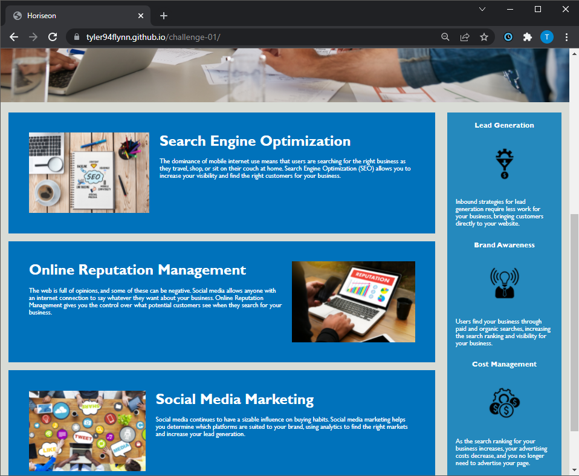

# challenge-01: CSS & HTML Code Refactor
## Code Refactor by Tyler Flynn
tyler94flynn@gmail.com
#

## Table of Contents
* [Link to Page](#link-to-page)
* [Description](#description)
* [Project Overview](#project-overview)
* [Grading Criteria](#grading-criteria)
#

## Link to Page

[https://tyler94flynn.github.io/challenge-01/](https://tyler94flynn.github.io/challenge-01/)

## Description
Refactored an existing website to follow agile principles and accessibility standards while preserving all visual elements. More specifically:

- Edited title tag in index head to "Horiseon" (from "website")
- Fixed missing id pointer in first object "Search Engine Optimization"
- Added nav, main, section, footer div semantics, heading order semantics (h2 --> h4)
- Consolidated Header, Features (formerly "content"), Benefits, Footer divs/classes & attributes
- Changed order of Features/Benefits CSS sections (and some subsections like float css classes) to align with order in index.html
- Added clear & concise image alt text for accessibility
- Did not change the website visually at all, except for the change of the page title to "Horiseon" from "website." View screenshot of refactored website below:




## Project Overview
### User Story

```
AS A marketing agency
I WANT a codebase that follows accessibility standards
SO THAT our site is optimized for search engines
```

### Acceptance Criteria

```
GIVEN a webpage that meets accessibility standards
WHEN I view the source code
THEN I find semantic HTML elements
WHEN I view the structure of the HTML elements
THEN I find that the elements follow a logical structure independent of styling and positioning
WHEN I view the icon and image elements
THEN I find accessible alt attributes
WHEN I view the heading attributes
THEN I find that they fall in sequential order
WHEN I view the title element
THEN I find a concise, descriptive title
```

## Grading Criteria

### Technical: 40%
- Application's links all function correctly.
- Application's CSS selectors and properties are consolidated and organized to follow semantic structure.
- Application's CSS file is properly commented.

### Deployment: 32%
- Application deployed at live URL.
- Application loads with no errors.
- Application GitHub URL submitted.
- GitHub repository that contains application code.

### Application Quality: 15%
- Application resembles (at least 90%) screenshots provided in challenge instructions.

### Repository Quality: 13%
- Repository has a unique name.
- Repository follows best practices for file structure and naming conventions.
- Repository follows best practices for class/id naming conventions, indentation, quality comments, etc.
- Repository contains multiple descriptive commit messages.
- Repository contains quality README file with description, screenshot, and link to deployed application.